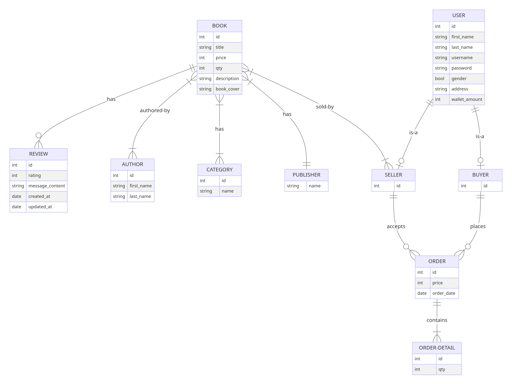

# BookEra

Welcome to BookEra, an e-commerce platform dedicated to book enthusiasts! Whether you're a reader looking for your next favorite book or a seller wanting to share your collection, BookEra is the place for you.

## Table of Contents

- [Project Overview](#project-overview)
  - [Work Breakdown Structure (WBS)](#work-breakdown-structure-wbs)
  - [Entity-Relationship Diagram (ERD)](#entity-relationship-diagram-erd)
  - [Sequence Diagrams](#sequence-diagrams)
- [Contributing to BookEra](#contributing-to-bookera)
  - [Getting Started](#getting-started)
  - [Making Changes](#making-changes)
  - [Submitting Changes](#submitting-changes)
- [Thank You!](#thank-you)

## Project Overview

### Work Breakdown Structure (WBS)

Explore the project's structure and milestones through our Work Breakdown Structure (WBS). Get a visual overview of the key tasks and phases 

### Entity-Relationship Diagram (ERD)

Understand the database schema and relationships with our Entity-Relationship Diagram (ERD). Dive into the data model 

### Class Diagram

The class diagram provides a visual representation of the classes in this project, their attributes, methods, and the relationships between them. It is a useful tool for understanding the overall structure of the code and how different components interact with each other.

You can view the class diagram for this project at the following link:

[Class Diagram](./docs/classDigram.png)

### Sequence Diagrams

For detailed insights into the system's interactions, view our Sequence Diagrams [here](./docs/Sequence%20Diagrams/)
## Contributing to BookEra

Thank you for considering contributing to BookEra! Your involvement helps us build a vibrant community for book lovers. Here's how you can get started:

### Getting Started

1. Fork the repository on GitHub.
2. Clone your fork to your local machine.
3. Create a new branch for your changes using `git checkout -b <your-branch-name>`.

### Making Changes

1. Make your changes to the codebase. Ensure your code is clean and well-commented.
2. Commit your changes in logical chunks. Follow these [git commit message guidelines](https://chris.beams.io/posts/git-commit/) to enhance the readability of your commits.
3. Push your changes to your fork on GitHub using `git push origin <branch-name>`.

### Submitting Changes

1. Submit a pull request to the repository via the GitHub UI.
2. Our maintainers will review your pull request. They may ask for changes or provide feedback.
3. Once approved, your changes will be merged into the main codebase.

## Thank You!

Your contribution makes BookEra better for everyone. Whether you're fixing a bug, adding a feature, or improving documentation, your efforts are appreciated. Happy coding, and happy reading!
